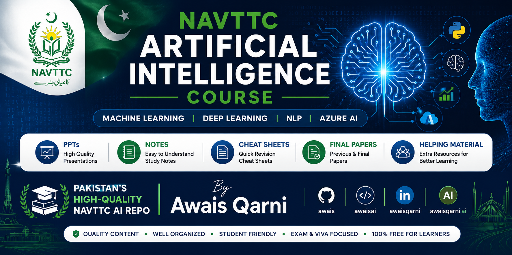

# Artificial Intelligence (Machine Learning & Deep Learning) – NAVTTC Pakistan



Official-style, high‑quality resources for the **NAVTTC Artificial Intelligence (Machine Learning & Deep Learning) 3‑month course in Pakistan**, based on the original government course outline and weekly lesson plan.
This repo is maintained by **Awais Qarni (awais / awaisai / awaisqarni / awaisqarni ai)** and aims to be the No.1 source for genuine NAVTTC AI material on GitHub.

---

## What you get in this repo

- Complete **PPTs, slides and helping material** for almost every topic in the official NAVTTC AI (ML & DL) curriculum: Linux, Python, statistics, NumPy, pandas, ML, DL, NLP and Azure AI.
- **Model and algorithm cheat sheets** (regression, classification, SVM, trees, ensembles, neural networks, CNN, RNN, LSTM, GRU, embeddings, Azure services, etc.) aligned with the weekly schedule.
- **Recent authentic NAVTTC final papers and exam-style questions** collected from real batches to help you prepare with original patterns.

---

## Mapped to official NAVTTC AI outline

All content is organized according to the **Government of Pakistan – National Vocational & Technical Training Commission (NAVTTC)** 3‑month course titled _“Artificial Intelligence (Machine Learning & Deep Learning)”_ under **Prime Minister’s Hunarmand Pakistan, Skills for All**.
Modules covered include Linux shell scripting, Python fundamentals & OOP, descriptive statistics and probability, NumPy/pandas/EDA, classical machine learning, NLP, deep learning (CNN, RNN, LSTM, GRU, Word2Vec, sequence models), employable project, and Microsoft Azure AI services.

---

## Why this NAVTTC AI repo is different

- Focused **only** on the official **NAVTTC AI / NAVTTC Artificial Intelligence (ML & DL)** course, not a generic AI tutorial.
- Contains **ready‑to‑teach PPTs, clean notebooks, and cheat sheets**, so trainers and students can use it as a plug‑and‑play reference during class or self‑study.
- Includes Pakistan‑specific context: job roles (AI associate engineer, ML analyst, assistant data analyst, research assistant) and tools like Microsoft Azure AI Associate/NLP tracks referenced in the course outline.

**SEO keywords (GitHub & Google discoverability):**  
`navtac ai`, `navttc ai`, `navttc artificial intelligence course`, `navttc ai course`, `navttc ai ml dl`, `artificial intelligence (machine learning & deep learning) navttc`, `navttc ai github`, `navttc ai pakistan`, `awais`, `awaisai`, `awaisqarni`, `awaisqarni ai`.

---

## Quick start

1. Clone the repo:
   ```bash
   git clone https://github.com/<your-username>/Artificial-Intelligence-NAVTTC.git
   cd Artificial-Intelligence-NAVTTC
   ```
2. (Optional) Create a virtual environment and install requirements:

   ```bash
   python -m venv .venv
   source .venv/bin/activate  # Linux / macOS
   .venv\Scripts\activate     # Windows

   pip install -r requirements.txt
   ```

3. Open the weekly folders (Week01, Week02, … Week12) and follow along with the same sequence given in the official NAVTTC lesson plan PDF.

---

## Suggested GitHub metadata (for better ranking)

- **Repository name:** `Artificial-Intelligence-NAVTTC` or `NAVTTC-AI-ML-DL-Course-Pakistan`.
- **Description:**  
  `Official-style NAVTTC Artificial Intelligence (Machine Learning & Deep Learning) Pakistan course – PPTs, cheat sheets, final papers, and high-quality material by Awais Qarni (awais / awaisai / awaisqarni ai).`
- **Topics:**  
  `navttc`, `navtac-ai`, `navttc-ai`, `artificial-intelligence`, `machine-learning`, `deep-learning`, `nlp`, `azure-ai`, `pakistan`, `course`, `awais`, `awaisqarni`, `awaisai`, `awaisqarni-ai`.

---

## Credits

This repository is inspired by and mapped to the **NAVTTC official course outline “Artificial Intelligence (Machine Learning & Deep Learning) – Duration: 3 Months”** and its associated annexures and task list.
Content is curated, cleaned and extended by **Awais Qarni** to support students, trainers and AI enthusiasts searching for **NAVTTC AI / NAVTAC AI** material on GitHub and the wider web.
